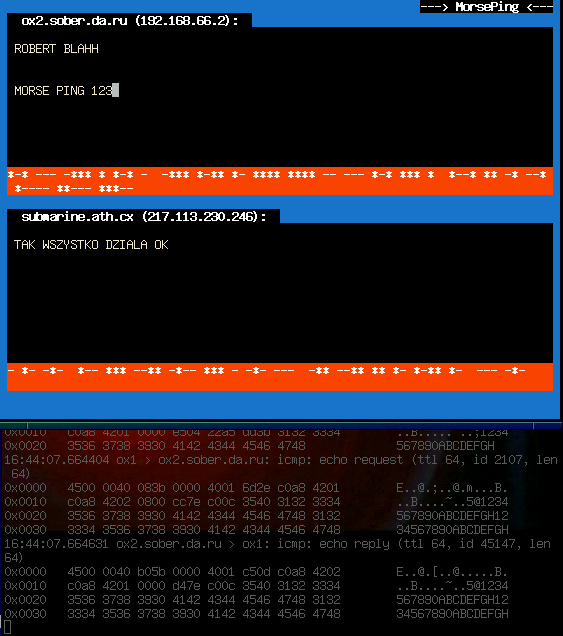

# morseping
Network communicator written in C, sending ICMP pings in Morse code

Robert Nowotniak, 2002
rnowotniak@gmail.com

The main source code written in C is available here in the repository: [MorsePing.c](https://github.com/rnowotniak/morseping/blob/master/MorsePing.c).

